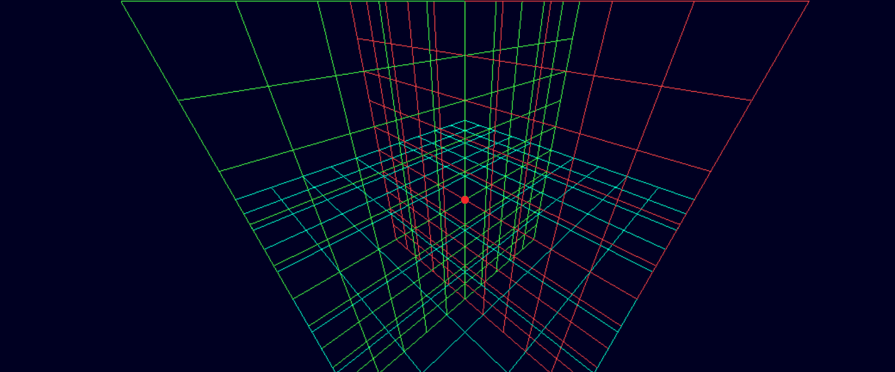

# **Precision Pathways**



### **A Vision for Innovation**

Precision Pathways isn’t just another project, it’s a bold leap towards bridging the gap between technology and healthcare. With every milestone, we’re shaping the future of surgery, one landmark at a time.

### **Revolutionizing Surgical Instrument Tracking**

Precision Pathways is an exciting project dedicated to transforming how instruments are tracked during surgeries. Picture a world where complex procedures are enhanced with precise, real-time insights, empowering medical professionals to navigate anatomy with complete confidence. By harnessing advanced imaging technologies, like DICOM files, this project paves the way for more efficient and life-saving surgical interventions.

The ultimate goal is to seamlessly map and monitor the positions of critical instruments in relation to anatomical landmarks. Every millimeter matters when it comes to saving lives.

---

### **Precision API**

At the heart of this project is the Precision API, the reliable tracker responsible for monitoring and sending real-time locations of instruments for seamless integration with connected systems. Built on the dependable NestJS framework, the API ensures robust communication and exceptional performance.

---

### **Notebooks**

This is a development-facing folder that hosts Jupyter notebooks, designed for processing data like converting DICOM images into SIL objects. It serves as a crucial component for preparing and refining inputs for the system.

---

### **Precision Viewer**

The Precision Viewer is where everything comes to life, presenting instrument locations in an interactive 3D space. From healthcare professionals to tech enthusiasts, this viewer transforms raw data into visually captivating and intuitive insights.

---

### **Our Exciting TODOs** 🚀

1. [ ] **Convert DICOM Files to SIL Objects**: Transform raw medical imaging files into objects that can load seamlessly in our Angular app.
2. [x] **Improve 3D Controls**: Add functionality to zoom in, pan, and interact with the 3D space for an enhanced user experience.
3. [ ] **Refine Coordinate Generation**: Make the random coordinate generator more natural and smooth—perfect for showcasing at hackathons!
4. [ ] **Process Video Streams**: Enable the same level of processing for video streams as we do for DICOM files, unlocking more possibilities.
5. [ ] **Implement Computer Vision**: Use cutting-edge computer vision techniques to track objects in video streams and render them dynamically in the Three.js canvas. This would be a groundbreaking achievement!

---

### **Tools Required for Local Development**

To set up and develop this workspace locally, here’s what you’ll need:

#### **Essential Tools**
1. **Node.js**  
   - Required for running the backend (`Precision API`) and frontend (`Precision Viewer`) projects.  
   - Install the latest LTS version from [Node.js official website](https://nodejs.org).

2. **npm (Node Package Manager)**  
   - Comes bundled with Node.js and manages dependencies for both projects.

3. **Angular CLI**  
   - Needed for developing and running the `Precision Viewer` frontend.  
   - Install globally using:  
     ```bash
     npm install -g @angular/cli
     ```

4. **NestJS CLI**  
   - Required for developing and running the `Precision API` backend.  
   - Install globally using:  
     ```bash
     npm install -g @nestjs/cli
     ```

5. **Docker**  
   - Used to containerize and run both projects together.  
   - Install it from [Docker's official website](https://www.docker.com).

6. **Git**  
   - Essential for version control and cloning repositories.  
   - Get it from [Git's official website](https://git-scm.com).

#### **Optional Tools**
1. **Visual Studio Code**  
   - A powerful IDE for editing and debugging.  
   - Recommended extensions include:
     - **Angular Language Service** for Angular development.
     - **ESLint** for code linting.
     - **Docker** for managing containers.

2. **Postman**  
   - Great for testing API endpoints of the `Precision API`.  
   - Download from [Postman](https://www.postman.com).

3. **Three.js Documentation**  
   - A resource for working with 3D rendering in the `Precision Viewer`.  
   - Access it at [Three.js official site](https://threejs.org/docs).

---

### **Steps to Run the Docker Compose File**

 ### **Steps to Run the Docker Compose File**

1. **Load the DICOM 3D Model**  
   - Open the `notebooks/dicom_processor.ipynb` notebook.  
   - Run all cells to process the DICOM files and generate the 3D model.

2. **Navigate to the Project Directory**  
   Open your terminal and navigate to the folder containing the `docker-compose.yml` file:
   ```bash
   cd /path/to/project-directory
   ```

3. **Build the Docker Containers**  
   Run the following command to build the containers without using the cache:
   ```bash
   docker compose build --no-cache
   ```

4. **Start the Docker Containers**  
   Use the following command to start the containers and recreate them if necessary:
   ```bash
   docker compose up --force-recreate
   ```

4. **Access the viewer**  
   The precision tracker view will be available on [http://localhost:5000](http://localhost:5000)